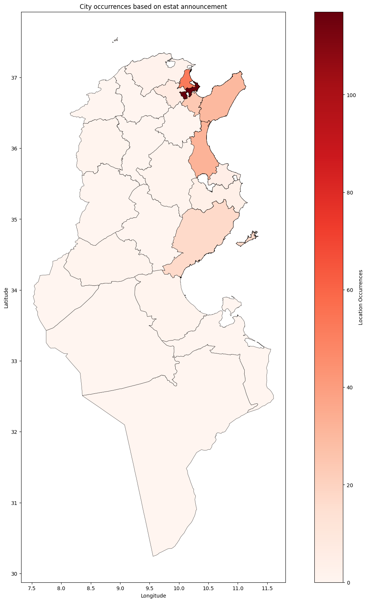
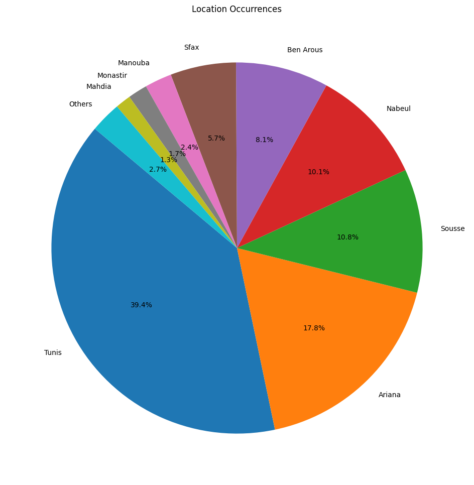

# Tayara.tn Web Scraping and Data Visualization

This repository contains the code and data related to web scraping, data cleaning, and data visualization of  the Tayara.tn website. The project aims to gather, process, and visualize data on the Estat market and giving it a geospatial aspect  .

## Table of Contents

- [Introduction](#introduction)
- [Web Scraping](#web-scraping)
- [Data Cleaning](#data-cleaning)
- [Data Visualization](#data-visualization)

## Introduction

- This projects aims to showcases the different aspect of Estat market through analysis using Python.

## Web Scraping

The web scraping phase of this project was implemented using Python and the Beautiful Soup library. This process involved extracting data from the AutoMobile.tn website to collect information related to Estat  Price , Location and Estat type   .

**Key Steps:**

- Used the requests library to send HTTP requests to the Tayara.tn website.
- Iterated through multiple web pages to gather a list of individual announcement then i iterated through these announcement  .
- Employed Beautiful Soup to parse the HTML content of the web pages and extract specific data elements, such as  Estat  Price , Location and Estat type .

**Challenges:**

- The website structure was hard to deal with and to parse through .

## Data Cleaning

- Cleaning the data was about eleminating doubles, changing columns data types and preparing the data for visualization for that i used Pandas and Geopandas  .

## Data Visualization

- The data Visualization part i used Matplotlib Library to create pie chart and to show case geospatial files.

- Geospatial Aspect.

- Pie chart.

